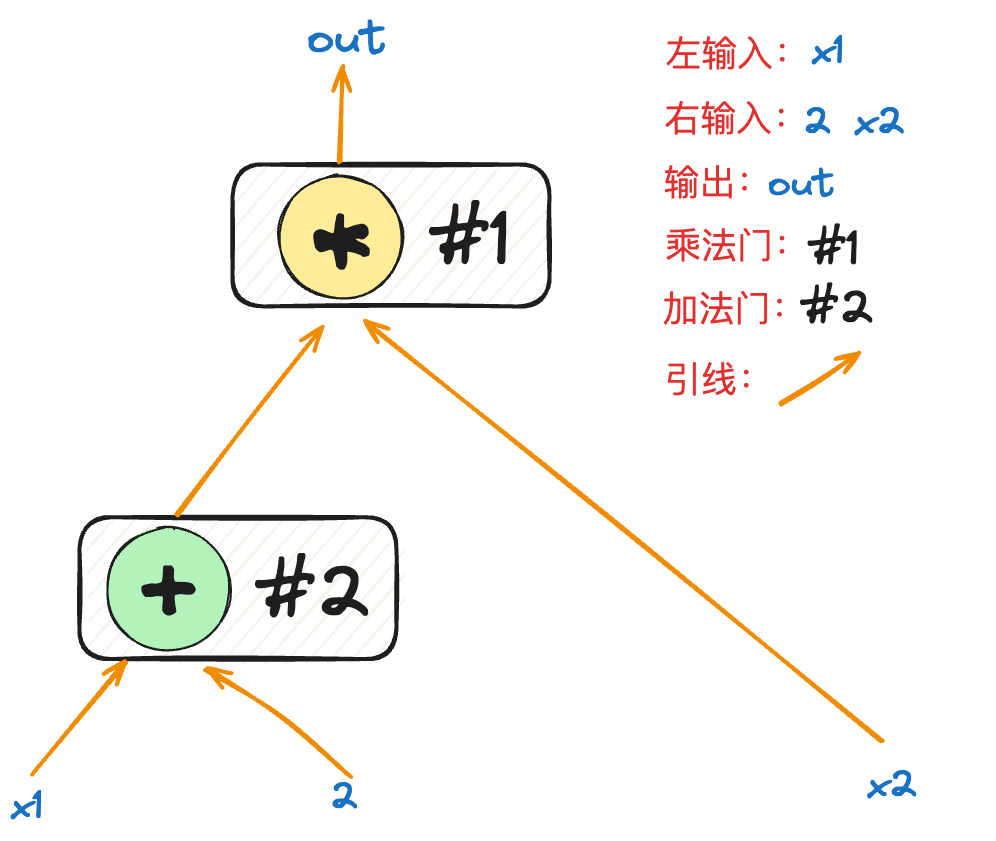
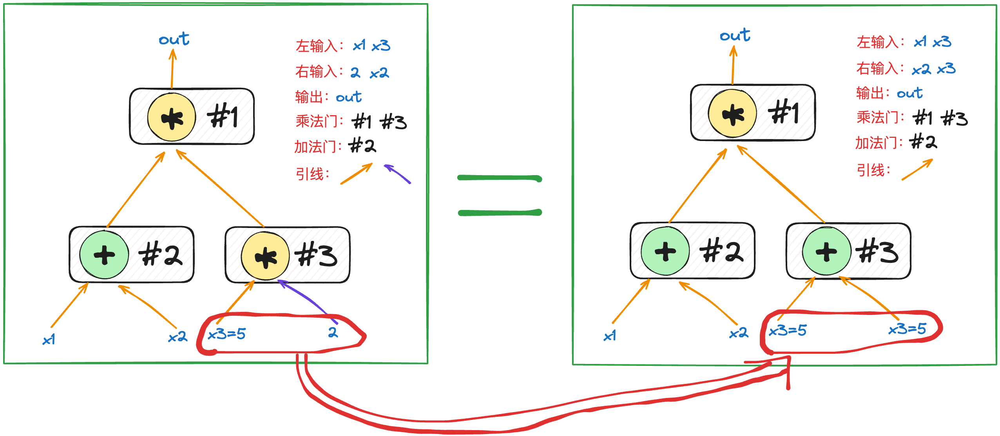

# R1CS 和 Plonkish 比较

 

## 算术电路与 R1CS 算术化
一个算术电路包含若干个乘法门与加法门。每一个门都有「两个输入」引脚和一个「输出」引脚，任何一个输出引脚可以被接驳到多个门的输入引脚上。

 

### 当乘法门<2

先看一个非常简单的算术电路：

这个「图12:电路2-0」表示了这样的一个计算：

$$
(x_1 + 2) \cdot x_2 = out
$$

这个电路包括以下组成部分：

- 三个算数门，其中 #1 是乘法门，#2 是加法门；
- 电路中有 3 个变量，其中三个变量为输入变量 $(x_1, x_2)$ ，一个输出变量 $out$，其中还有一个输入为常数，其值为 $2$。

R1CS 是通过乘法门为中心，用三个「选择子」来「选择」乘法门的「左输入」、「右输入」、「输出」都分别连接那些变量。所谓的「选择子」可以理解为一组预先确定的系数，它们告诉我们哪些变量会连接到乘法门的「左输入」、「右输入」和「输出」。

就「图12:电路2-0」来看，我们可以直接看乘法门 #1，因为它的左输入是$x_1+2$，右输入是 $x_3$，而在 R1CS 中，加法门 #2 的输出可以被直接包含在线性等式（$x_1+2$）中，而无需引入额外的中间变量名。

接下来我们将进行线性约束的转换，其实就是定义变量向量和选择子向量。

一个电路有两种状态：「空白态」和「运算态」。当输入变量没有具体值的时候，电路处于「空白态」，这时我们只能描述电路引线之间的关系，即电路的结构拓扑。

**那么我们如何来表示电路的「空白态」呢？就是通过定义变量向量，**编码各个门的位置，和他们之间引线连接关系。

在「图12:电路2-0」这个电路中，我们定义一个变量向量 $\vec{z}=[1,x_1,x_2,out]$

💡 注：
1. 在定义变量向量这个阶段，我们没有赋值给这些变量，它们只是占位符。
2. 向量 $z$ 中的常数 1 作为第一个元素以支持常数的选择子

之后，我们来表示电路的「运算态」，我们可以将 $(x_1 + 2) \cdot x_2 = out$ 表示为 $z$ 的线性组合，便于验证和计算：

$$
\begin{array}{l}
(2 \cdot 1 + 1 \cdot x_1+ 0 \cdot x_2+ 0 \cdot out)\cdot (0 \cdot 1 + 0 \cdot x_1 +1 \cdot x_2 + 0 \cdot out)
\\ = (0 \cdot 1 + 0 \cdot x_1+ 0 \cdot x_2+ 1 \cdot out)
\end{array}
$$

那么电路的左输入向量 $U$ 对应的选择子向量为 $U =[2,1,0,0]$，其中：

- `2` 对应常数项 $2$
- `1` 对应 $x_1$

其次是电路的右输入向量 $V$ 对应的选择子向量 $V=[0,0,1,0]$， 其中：

- `1` 对应 $x_2$

电路的输出向量  $W$ 对应的选择子向量为 $W=[0,0,0,1]$， 其中：

- `1` 对应 $out$

有了三个向量 $[U,V,W]$，我们可以通过一个「内积」等式来表示输出 $out$ 的约束：

$$
(U⋅\vec{z})⋅(V⋅\vec{z})=W⋅\vec{z}
$$

具体地，内积计算如下：

$$
\begin{array}{l}
(U⋅z)=2⋅1+1⋅x_1+0⋅x_2+0⋅out=2+x_1 \\
(V⋅z)=0⋅1+0⋅x_1+1⋅x_2+0⋅out=x_2 \\
(W⋅z)=0⋅1+0⋅x_1+0⋅x_2+1⋅out=out
\end{array}
$$

这个内积等式化简之后正好可以得到：

$$
(2+x_1)⋅x_2=out
$$

完美！

接下来，我们可以赋值验证一下。令 $x_1 =3$，$x_2=4$，代入内积等式中，那么 $out=20$。把这几个变量换成赋值向量 $[1,x_1,x_2,out] = [1,3,4,20]$，那么电路的运算可以通过「内积」等式来验证：

$$
(U\cdot[1,3,4,70])\cdot(V\cdot[1,3,4,70])=W\cdot[1,3,4,70]
$$

具体的计算：

$$
\begin{array}{l}
([2,1,0,0]\cdot [1,3,4,20])\cdot([0,0,1,0]\ cdot[1,3,4,20]) \\
= (2+3)\cdot 4\\
= 20
\end{array}
$$

$$
\begin{array}{c}
[0,0,0,1]\cdot [1,3,4,20]=20
\end{array}
$$

两边相等，满足 

$$
(U\cdot(1,3,4,20))\cdot(V\cdot(1,3,4,20))=W\cdot(1,3,4,20)
$$

我们验证了这个电路给定的输入输出值，也就是电路的运算是没有问题的。

但是如果赋值向量有错误，例如赋值变量是$\vec{z}= [1,3,4,70]$ ，则不满足「内积等式」：

$$
(U\cdot(1,3,4,70))\cdot(U\cdot(1,3,4,70))\neq W\cdot(1,3,4,70)
$$

左边输入的运算结果为 $20$，右边运算结果为 $70$。当然，我们可以验证其它合法（满足电路约束）的赋值。

并不是任何一个电路都存在赋值向量。凡是存在合法的赋值向量的电路，被称为可被满足的电路。判断一个电路是否可被满足，是一个 NP-Complete 问题，也是一个 NP 困难问题。

值得一提的事，有一类「常数乘法门」，只有一边的输入为变量，另一边为常数。这一类「常数乘法门」也把它们看作为特殊的「加法门」，如下图所示，左边电路右下的乘法门等价于右边电路的右下加法门。

上面说的是电路本身是一个乘法门或者可以转换成一个乘法门来处理的情况，可如果一个电路含有两个以上的乘法门，我们就不能用  $𝑈,𝑉,𝑊$ 三个向量之间的内积关系来表示运算，而需要构造「三个矩阵」的运算关系。

---

 

### 当乘法门 >2

比如下图所示电路，有两个乘法门，他们的左右输入都涉及到变量。

这个电路表示了这样的一个计算：

$$
(x_1 + x2) \cdot (x3 \cdot x4) = out
$$

我们以**乘法门**为基准，对电路进行编码。第一步将电路中的乘法门依次编号（无所谓编码顺序，只要前后保持一致）。图中的两个乘法门编码为 `#1` 与 `#3`。

然后我们需要为每一个乘法门的中间值引线也给出变量名：比如四个输入变量被记为 $x_1, x_2, x_3, x_4$，其中 $x_6$ 为乘法门 #3 的输出，同时作为乘法门 #1 的右输入。而 $out$ 为乘法门 #1 的输出。其中 $x_5$ 是加法门 #2 的输出，在 R1CS 中，我们将其隐匿掉了，$x_5$ 只需要用 $x_1+x_2$ 即可得出。

根据上面的关系，于是我们可以得到一个关于该电路「空白态」变量名的向量：

$$
\vec{z’}=[1, x_1, x_2, x_3, x_4, x_6, out]
$$

接下来，我们构造「三个矩阵」的运算关系。

$U, V, W \in \mathbb{F}^{n\times m}$（$n$ 代表的是乘法门的数量，$m$ 代表的是变量的数量）

每一个矩阵的第 $i$ 行「选择」了第 $i$ 个乘法门的输入输出变量。比如我们定义电路的左输入矩阵  $U$ ：

$$
\begin{array}{|c|c|c|c|c|c|c|c|}
\hline
\texttt{i} &1 &x_1 & x_2 & x_3 & x_4 & x_6 & out \\
\hline
\texttt{1}&0 &1 & 1 & 0 & 0 & 0 & 0 \\
\hline
\texttt{2}&0 & 0 & 0 & 1 & 0 & 0 & 0 \\
\hline
\end{array}
$$

其中乘法门 #1 的左输入为 $(x_1+x_2)$， 乘法门 #3 的左输入为 $x_3$。

右输入矩阵 $V$ 定义为：

$$
\begin{array}{|c|c|c|c|c|c|c|c|}
\hline
\texttt{i}& 1 & x_1 & x_2 & x_3 & x_4 & x_6 & out \\
\hline
\texttt{1}& 0 & 0 & 0 & 0 & 0 & 1 & 0 \\
\hline
\texttt{2}& 0 &0 & 0 & 0 & 1 & 0 & 0  \\
\hline
\end{array}
$$

其中乘法门 #1 的右输入为 $x_6$，乘法门 #3 的右输入为 $x_4$。

最后定义输出矩阵 $W$：

$$
\begin{array}{|c|c|c|c|c|c|c|c|}
\hline
 \texttt{i} &1& x_1 & x_2 & x_3 & x_4 & x_6 & out\\
\hline
 \texttt{1} & 0 & 0 & 0 & 0 & 0 & 0 & 1\\
\hline
 \texttt{2} & 0 & 0 & 0 & 0 & 0 & 1 & 0\\
\hline
\end{array}
$$

有了变量向量 $\vec{z’}$，以及选择子向量 $U,V,W$，于是我们可以轻易地检验下面的等式：

$$
(U \cdot \vec{z’}) \circ (V \cdot \vec{z’}) = (W \cdot\vec{z’})
$$

其中符号 $\circ$ 为 Hadamard Product，表示「按位乘法」。展开上面的按位乘法等式，我们可以得到这个电路的运算过程：

$$
\left[
\begin{array}{c}
x_1 + x_2 \\
x_3 \\
\end{array}
\right]
\circ
\left[
\begin{array}{c}
x_6 \\
x_4 \\
\end{array}
\right]=
\left[
\begin{array}{c}
out \\
x_6 \\
\end{array}
\right]
$$

所以我们可以得到两个等式，符合最初的电路约束关系：

$$
(x_1+x_2)\cdot x_6=out
x_3\cdot x_4=x_6
$$

表明电路的输入输出值无误。

 

## 优缺点

由于 R1CS 编码以乘法门为中心，于是电路中的加法门并不会增加 $U, V, W$ 矩阵的行数，因而对 Prover 的性能影响不大。R1CS 电路的编码清晰简单，利于在其上构造各种 SNARK 方案。

在 2019 年 Plonk 论文中的编码方案同时需要编码加法门与乘法门，看起来因此会增加约束的数量，降低 Proving 性能。但 Plonk 团队随后陆续引入了除乘法与加法外的运算门，比如实现范围检查的门，实现异或运算的门等等。不仅如此，Plonk 支持任何其输入输出满足多项式关系的门，即 Custom Gate，还有适用于实现 RAM 的状态转换门等，随着查表门的提出，Plonk 方案逐步成为许多应用的首选方案，其编码方式也有了一个专门的名词：Plonkish。

R1CS 的 $(U,V,W)$ 表格的宽度与引线的数量有关，行数跟乘法门数量有关。这个构造相当于把算术电路看成是仅有乘法门构成，但每个门有多个输入引脚（最多为所有引线的数量）。而 Plonkish 则是同等对待加法门与乘法门，并且因为输入引脚只有两个， 所以 $W$ 表格的宽度固定，仅有三列（如果要支持高级的计算门，表格可以扩展到更多列）。这一特性是 Plonk 可以利用 Permutation Argument 实现拷贝约束的前提。

> ..., and thus our linear contraints are just wiring constraints that can be reduced to a permutation check.
> 

按照 Plonk 论文的统计，一般情况下，算术电路中加法门的数量是乘法门的两倍。如果这样看来， $W$ 表格的长度会三倍于 R1CS 的矩阵。但这个让步会带来更多的算术化灵活度。

 

# 参考文献

- [BG12] Bayer, Stephanie, and Jens Groth. "Efficient zero-knowledge argument for correctness of a shuffle." *Annual International Conference on the Theory and Applications of Cryptographic Techniques*. Springer, Berlin, Heidelberg, 2012.
- [GWC19] Ariel Gabizon, Zachary J. Williamson, and Oana Ciobotaru. "Plonk: Permutations over lagrange-bases for oecumenical noninteractive arguments of knowledge." *Cryptology ePrint Archive* (2019).